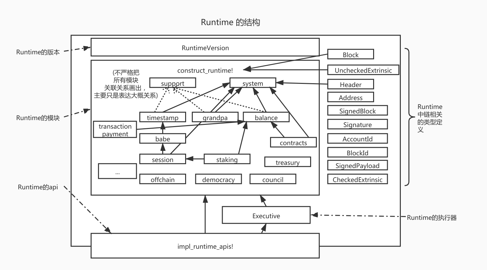

# Substrate 入门 - Runtime的构成 -（十）

由于疫情原因，以及近期在忙于其他开发，因此文章停滞了一段时间。之前的文章已经介绍了Runtime的概要以及Runtime的wasm，因此读者应该具备了对Runtime的全局观念以及如何通过编译过程的基本知识。因此从本文开始，将会进入对Runtime的正式介绍。

本文首先介绍Substrate的Runtime的构成。

## 一个完整的Substrate Runtime

对于一个完成的Runtime，其主要实现位于：`bin/node/cli/src/lib.rs`中。

一个Runtime一定需要含有如下组件：



1. RuntimeVersion：用于标示当前Runtime的版本，是用于区分执行wasm和native的重要属性。每次若出现逻辑变更**都应该**手动修改这个版本号（其中分影响共识结果和不影响共识结果的版本）。若出现了影响共识结果的改动但不修改这个版本号，并仍然部署了修改后的wasm，可能会造成无法出块或者无法同步等严重后果。
2. Runtime的模块实现`construct_runtime!`：构建Runtime所有模块的宏。在编写了一个Runtime的模块后，必须通过这个宏引入构建。在这个宏里会生成很多其他的附属信息如该模块的结构体，对应的一些trait的实现，metadata，等等。
   1. 在`lib.rs`中的trait的关联属性以及api的调用中可以看到类似`type Currency = Balances;`，`type Time = Timestamp;`等的定义，这个关联属性右边的类型就是通过这个宏展开得到。
   2. 这个宏的构建中，控制了每个模块会导出一些属性如`Storage`，`Call`，`Event`，`Config`等等
   3. 在这个宏中`System`是特殊的，一定要引入。
   4. 除了对应每个模块生成对应的类型以外，这个宏还会生成一些统一的类型和信息如`Runtime`这个结构体，`AllModules`，`Call`等等。
3. Runtime中与链相关的一些类型定义：如区块，交易体，区块头等等。有一些定义要参与到`construct_runtime!`宏中的构建，有一些定义需要对外暴露提供调用。Substrate的抽象很好，基本上所有链的基本元素定义都是可以自由定制的。例如签名可以替换成单个签名或允许多种类型秘钥的签名，地址可以替换成使用accountid或兼容几种查询等等。
4. Runtime的执行器：执行器虽然也是一个Runtime模块，但其是特殊的，甚至比System模块还特殊。执行器不参与`construct_runtime!`宏的构建，而是直接定义。其提供了Runtime正常运行的所有接口，如初始化，执行区块，执行交易，验证交易等等。执行器需要依托`construct_runtime!`宏导出的`AllModules`，也就是说执行器持有所有模块的类型，将会控制这些模块的`OnInitialize`，`OnFinalize`等等。
5. Runtime的Api实现`impl_runtime_apis!`：前面的文章介绍过Runtime与外界交互的接口，这个宏即是所有api的实现部分。对于api首先先有定义api的宏`decl_runtime_apis!`，然后对应于这个定义的api，可以在`impl_runtime_apis!`中有对应的实现。Substrate默认提供了一些api的定义，其中`Core`的api定义是一定要实现的。其他的一些api如`BlockBuilder`，共识相关的api，虽然不是在`Core`里，但是为了让一个Runtime能以“链”的形式存在，也是一定要实现的，但是若作为平行链，那么例如和共识相关的这些api就不用存在了。

总体来说，拥有以上5部分可构成一个完整的Substrate Runtime。

## Runtime的模块构建

通过以上介绍可知，一个Runtime的核心就是`construct_runtime!`，其起到了集合所有Runtime模块并产生对于类型的作用。是整个Runtime的总控制开关。也就是通过这个宏，可以插拔的控制Runtime模块的引入，也就是控制“链的功能”。

`construct_runtime!`模块中每一行是一个模块，添加进入即代表构建当前Runtime的时候引入该模块。

一般而言，有一个模块是必不可少的：

* System：该模块用于描述链的一些基本属性，因此无论公链还是联盟链都必不可少。并且这个模块在`construct_runtime!`宏内也是被特殊处理的，必须位于第一个且不可缺少。在这个模块中需要参与块的初始化`on_initialize`，块的结束处理`on_finalize`，区块的块高，交易数量，父hash，交易根，事件Event等等一系列与链息息相关的数据定义都在这个模块里。可以说是类似“环境变量”这一概念在链中存在的地位。

除此之外的所有模块都是可选的，但是这里的可选的意思并非对于一条链，而只是对于基本构建而言。对于一条链所需要的模块，笔者大概分为以下两类：

* 满足链的业务逻辑
* 对Runtime外层一些功能的数据映射，或是提供数据让底层模块做出相应变更。

例如：

满足链的业务逻辑：

* `balances`模块，记录用户的资金变化，一般公链必须要有，联盟链根据需求裁定
* `staking`模块，pos公链必须，pow公链与联盟链反而不需要。
* `contracts`模块，合约模块，根据链业务逻辑觉得是否需要。
* `council`，`treasury`，`transactionpayment`等等，根据命名可以大概猜测其含义
* 等等

对Runtime外层起效或交互的模块

* `Babe`。使用babe共识必须，可以设置babe当前的出块人，底层babe共识模块会通过api读取当前的设置，当前的epoch 等等。例如一个epoch变化后，更换出块人列表，那么可以通过staking模块处理好对应的出块人列表然后设置进入babe的Runtime模块，然后在这轮出块中，底层的babe模块就可以读到最新的出块人列表。
* `Aura`。使用arua共识必须，和babe同理提供当前的出块人。
* `Grandpa`。提供grandpa验证人，同样可以在Runtime内通过其他逻辑变更影响底层grandpa逻辑进行确认
* `ImOnline`。底层通过内部交易/offchain等反馈当前节点存活情况，**是一个获知外界信息（oracle）的很好例子**
* `FinalityTracker`。提供grandpa的finality已经到哪一个块的模块，是**反馈底层模块信息的**例子
* 等等

而对于在`construct_runtime!`定义的每一行而言，类似：

```rust
System: frame_system::{Module, Call, Config, Storage, Event<T>}
```

在宏的注释中有简略介绍：

```rust
/// We provide support for the following module parts in a pallet:
///
/// - `Module`
/// - `Call`
/// - `Storage`
/// - `Event` or `Event<T>` (if the event is generic)
/// - `Origin` or `Origin<T>` (if the origin is generic)
/// - `Config` or `Config<T>` (if the config is generic)
/// - `Inherent ( $(CALL),* )` - If the module provides/can check inherents. The optional parameter
///                             is for modules that use a `Call` from a different module as
///                             inherent.
/// - `ValidateUnsigned`      - If the module validates unsigned extrinsics. 
```

这里稍微多做一些介绍：

这样的宏定义有一些类似rust中的`use module::{xxx, xxx}`，表示在通过`construct_runtime!`集成这个模块的时候需要导出这个模块的一些统一的功能。

* `Module`，表示导出这个模块的结构体，其结构体名字对应于这行定义开头，例如例子中的`System`，是这个模块产生于Runtime中的模块名，通过这个宏将会生成`pub struct System`，这个结构体，在`lib.rs`中引用中出现在`type=`右边的，在api中出现类似`Contracts::`这样的，这个结构体的名字是由这里的`Module`指定。因此若这个名字更改，相应的地方也需要做更改。

  ```rust
  System: frame_system::{Module}
  // Module 表示导出以这行开头的定义的结构体 System
  ```

* `Call`，表示导出这个模块可以对于的交易（Extrinsic）中的方法，例如`balances`中的`transfer`啊这类的。也就是`Call`是模块通过交易能够接受的接口调用。

* `Storage`，表示导出这个模块的存储。这里注意只要在模块内部定义了storage（后几篇文章会介绍），即使不导出这个存储这个存储也是存在的。这里是否导出更大的是影响metadata的生成。

* `Event`，表示导出这个模块的Event。对metadata影响大

* `Origin`，表示导出模块的Origin，对应于这个模块中定义了类似一下的origin定义

  ```rust
  pub struct Module<T: Trait<I>, I: Instance=DefaultInstance> for enum Call where origin: <T as frame_system::Trait>::Origin {
  ```

*  `Config`，表示是否导出genesis的配置，这个Config会影响genesis的生成

* `Inherent`，导出内部交易。其用法参考 `Timestamp`，这是个很好的例子。

* `ValidateUnsigned`，这个更多的和offchain相关。

以上即是对`construct_runtime!`粗略的介绍。

## 总结

本文介绍了Runtime的构成元素。通过本文应知道，一个Runtime基本上由5个部分组成，其中`construct_runtime!`的构成是最核心与重要的。应该理解`construct_runtime!`是Runtime模块的总开关，控制了该Runtime的组合逻辑。

