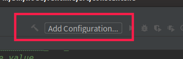
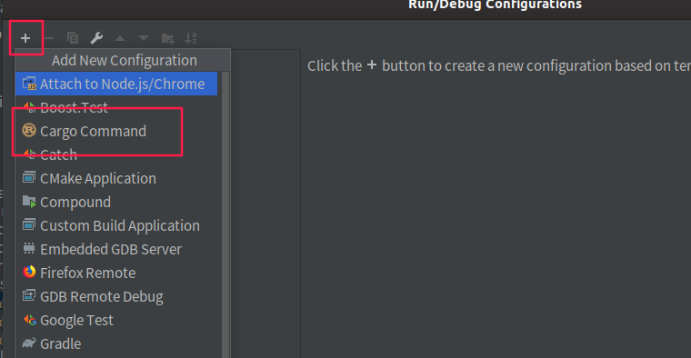
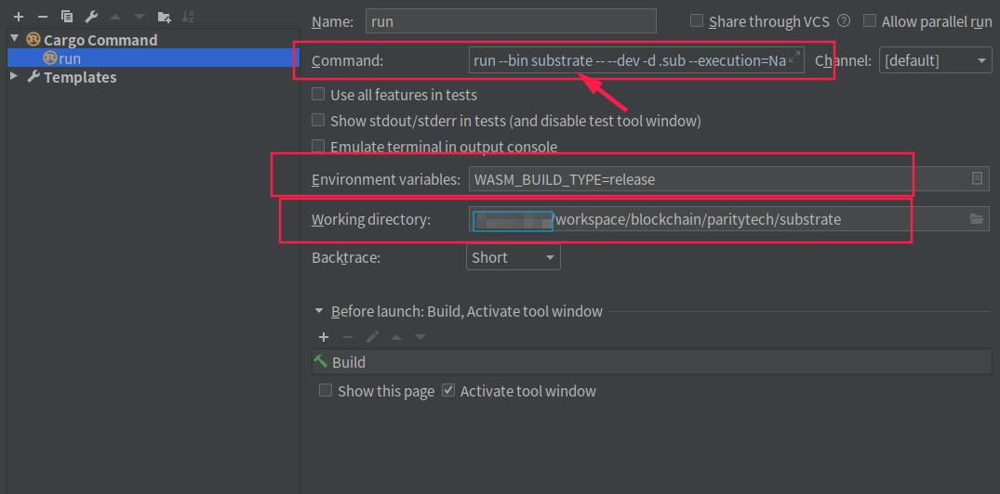
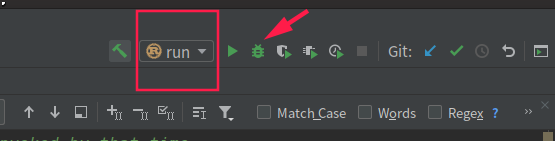
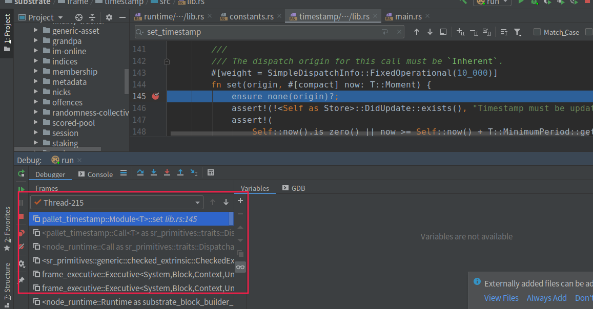

# Substrate 入门 - 运行与调试 -（二）

上一篇文章中介绍了substrate的环境配置与编译，本文描述如何运行节点并对其进行调试。

当能够对一个程序进行调试时，就相当于掌握了如何探究其原理的工具，剩下的只需要毅力和时间了。因此掌握调试方法是很重要的。

## 运行节点

对于学习Substrate而言，一开始只需要能够单节点运行即可。接上一章，能够使用`cargo build`以后，执行

```bash
cargo run --bin substrate -- --help
# 等价于 ./target/debug/substate -- --help
```

请大致浏览一下`help`信息，其中很多启动指令是很重要的。这里先大致看过来有一个印象。

ps：注意这里指定了`--bin substrate`，因为Substrate编译后会有多个执行文件，但是我们目前只需要了解substrate即可。

### 运行单节点

这里推荐运行单节点的方式为：

```bash
cargo run --bin substrate  -- --dev -d .sub --execution=NativeElseWasm
```

其中

* `--dev`是运行单节点的命令，具体内容请看help
* `-d` 是`--base-path`的简写，用于指定数据跟目录的，请注意若不指定这个目录，会默认把数据放在用户的目录下，linux系的操作系统将会放于`~/.local/share/substrate`目录下，mac os 位于`~/Library/Application Support/substrate` 与windows 位于`%APPDATA%\substrate` （例如`c:\User\<you account>\AppData\Roaming\substrate`）下。具体原理请参见这个库[app-dirs](https://docs.rs/app_dirs/1.2.1/app_dirs/)
* `--execution`是节点采用的执行方式，这里采用NativeElseWasm，尽量以Native的方式运行。Native与Wasm的关系请参见笔者之前的文章，后续也将专门花一篇文章讲解。这里为了调试请以Native的方式运行。

运行后，会出现以下日志：

```bash
2019-12-02 21:34:38 Running in --dev mode, RPC CORS has been disabled.
2019-12-02 21:34:38 Substrate Node
2019-12-02 21:34:38   version 2.0.0-33476f08b-x86_64-linux-gnu
2019-12-02 21:34:38   by Parity Technologies, 2017-2019
2019-12-02 21:34:38 Chain specification: Development
2019-12-02 21:34:38 Node name: squealing-volcano-7235
2019-12-02 21:34:38 Roles: AUTHORITY
2019-12-02 21:34:41 Initializing Genesis block/state (state: 0xcfa1…1f33, header-hash: 0x7aed…4a2a)
2019-12-02 21:34:41 Loading GRANDPA authority set from genesis on what appears to be first startup.
2019-12-02 21:34:42 Loaded block-time = BabeConfiguration { slot_duration: 3000, epoch_length: 200, c: (1, 4), genesis_authorities: [(Public(d43593c715fdd31c61141abd04a99fd6822c8558854ccde39a5684e7a56da27d (5GrwvaEF...)), 1)], randomness: [0, 0, 0, 0, 0, 0, 0, 0, 0, 0, 0, 0, 0, 0, 0, 0, 0, 0, 0, 0, 0, 0, 0, 0, 0, 0, 0, 0, 0, 0, 0, 0], secondary_slots: true } milliseconds from genesis on first-launch
2019-12-02 21:34:42 Creating empty BABE epoch changes on what appears to be first startup.
2019-12-02 21:34:43 Highest known block at #0
2019-12-02 21:34:43 Using default protocol ID "sup" because none is configured in the chain specs
2019-12-02 21:34:43 Local node identity is: QmPx8ErgDnK2yzcNzWWZfcpA5jG5BiqHnYhxj8uP78R1wP
2019-12-02 21:34:43 Starting BABE Authorship worker
2019-12-02 21:34:43 Grafana data source server started at 127.0.0.1:9955
2019-12-02 21:34:45 Starting consensus session on top of parent 0x7aed7beac8e270a7c1b94c388bf2dd458a583793eb1cf6cbdaac5c2b53bc4a2a
2019-12-02 21:34:47 Prepared block for proposing at 1 [hash: 0x9ef353fac64fb410da9dcddb413bc32605be0bddc37600f4308a8fe16c67cd48; parent_hash: 0x7aed…4a2a; extrinsics: [0xdd07…0f07]]
2019-12-02 21:34:47 Pre-sealed block for proposal at 1. Hash now 0x7092bd4729d239cc50ddea5ebca686956747d429ebc5fdd04437eb3d1b2c5144, previously 0x9ef353fac64fb410da9dcddb413bc32605be0bddc37600f4308a8fe16c67cd48.
2019-12-02 21:34:47 New epoch 0 launching at block 0x7092…5144 (block slot 525097895 >= start slot 525097895).
2019-12-02 21:34:47 Next epoch starts at slot 525098095
2019-12-02 21:34:47 Imported #1 (0x7092…5144)
2019-12-02 21:34:48 Idle (0 peers), best: #1 (0x7092…5144), finalized #0 (0x7aed…4a2a), ⬇ 0 ⬆ 0
2019-12-02 21:34:48 Starting consensus session on top of parent 0x7092bd4729d239cc50ddea5ebca686956747d429ebc5fdd04437eb3d1b2c5144
2019-12-02 21:34:48 Prepared block for proposing at 2 [hash: 0x401eaa5aad96fa270be3e8441e8f9b260496bc45594a314975be0a0e209bcd0c; parent_hash: 0x7092…5144; extrinsics: [0x147a…25aa]]
2019-12-02 21:34:48 Pre-sealed block for proposal at 2. Hash now 0x0c173a3e655a50bbc93998d15ab8adedac76bc751e9d8eea173132f51b8731eb, previously 0x401eaa5aad96fa270be3e8441e8f9b260496bc45594a314975be0a0e209bcd0c.
2019-12-02 21:34:48 Imported #2 (0x0c17…31eb)
```

按`CTRL+C`可以中断进程退出。

请注意，只有当日志中出现以下日志时

```bash
Starting consensus   # 共识准备
 Pre-sealed block  for proposing at <块高>, 区块hash, 父区块hash, 该区块中的交易hash # 预打包区块，其中的交易
 Imported #<块高>  # 区块落盘，一定要看到这一条才表示区块出块流程正常进行
```

才算区块正常出块。

其中，若编译时使用产生的WASM文件是debug（参见上一篇文章）时，或者当前的电脑cpu性能过于弱时，可能会产生

```bash
Discarding proposal for slot {}; block production took too long
```

的日志。

请注意如果确定**只是**因为当前环境的cpu性能过弱时，可以采取修改出块时间的方式先暂时回避这个问题

文件：`bin/node/runtime/src/constants.rs` 中，修改

```bash
# 请详细参见附近的注释，该常量用于控制出块时间间隔，因此当 took too long 的时候把出块时间加长
pub const MILLISECS_PER_BLOCK: Moment = 3000;
```

这个常量，将其修改得大一些，使得出块时间变长，这样第一次加载环境的时候就不会`took too long`导致无法出块了。

**请注意修改了这个常量后一定要重新编译，对于初学者而言若还搞不清楚其他情况时，请直接将之前生成的数据目录（`-d`指定的目录）直接删除，再重新运行节点**

## 调试

笔者使用Clion进行开发，因此这里只介绍clion调试的方式，使用gdb的开发者直接操作即可。

首先在clion中先设置编译配置：



然后点击左上角的“+”，选择`cargo command`



然后在以下位置配置相应的命令：



* `Command`的部分命令和之前启动命令一致，只需要把cargo去掉即可，因此也就是说这里的Command就是平时的启动命令，可以根据自己本身的命令进行配置，注意如果在下断点到runtime内部的时候，execution一定是要Native或者NativeElseWasm
* `Environment variables` 环境变量部分请配置上`WASM_BUILD_TYPE`
* `Working directory`配置上substrate的根目录

以上配置好了点Ok确定后，原来添加配置的部分会默认显示刚刚配置好的这个启动命令。

接下来下断点，对于初学者，下断点最好的部分位于每个块都会执行的一个部分：设置时间

因此我们把断点下在`frame/timestamp/src/lib.rs` 第 145行：


该部分即时每个块都会设置出块时间的地方。使用gdb的开发者同理，找到这个文件的这个地方下断点即可。

设置好断点后，即可点击右上角像虫子一样的按钮开始运行调试（建议先清空数据目录）



启动调试后，如果正常一会之后将会在断点处停下：



请注意左下方的调用栈，这即是最能帮助开发者了解代码运作过程的信息源。从调用栈中可以很快速了解很多信息。

而领边的`Variables`提供很多当前这个栈中数据的信息，对于debug相当有用。

## 日志

substrate使用了rust默认的日志接口，因此在substrate中看得到这样的日志：

```rust
info!(target: "babe",   "Creating empty BABE epoch changes on what appears to be first startup.");
```

请注意`info!`的第一个参数是`target:`，而不是日志内容。这个是用于日志标签分类打印。由于substrate使用的日志记录器是`env_logger`，并且substrate编写了一些运行时解析的代码

client/cli/src/ib.rs:L965

```rust
fn init_logger(pattern: &str) {
	use ansi_term::Colour;
    ...
   if let Ok(lvl) = std::env::var("RUST_LOG") {
		builder.parse_filters(&lvl);  // 这里，设置了日志filter
	}
    ...
}
```

因此启动时可以通过这个环境变量设置日志的过滤内容，如上面那个日志的target是"babe"，则启动时可以设置：

```bash
RUST_LOG=warn;babe=debug cargo run --bin substrate -- --dev -d .sub --execution-NativeElseWasm
# 或者
RUST_LOG=warn;babe=debug ./target/debug/substrate -- --dev -d .sub --execution-NativeElseWasm
```

同理，在clion的启动配置的`Environment variables` 中也可以配置这个环境变量。这样启动的节点就会

* 其他日志只打印 warning 级别的日志
* 对于 target 是 babe 的日志，会打印 debug 级别的日志

因此通过这种filter的形式，可以控制日志的打印，这样对调试节点及学习substrate有相当大的好处。

## 总结

本文主要说明了如何启动一个substrate节点，及启动节点后如何对节点进行调试，以及如何对节点中的日志进行filter以便于调试。