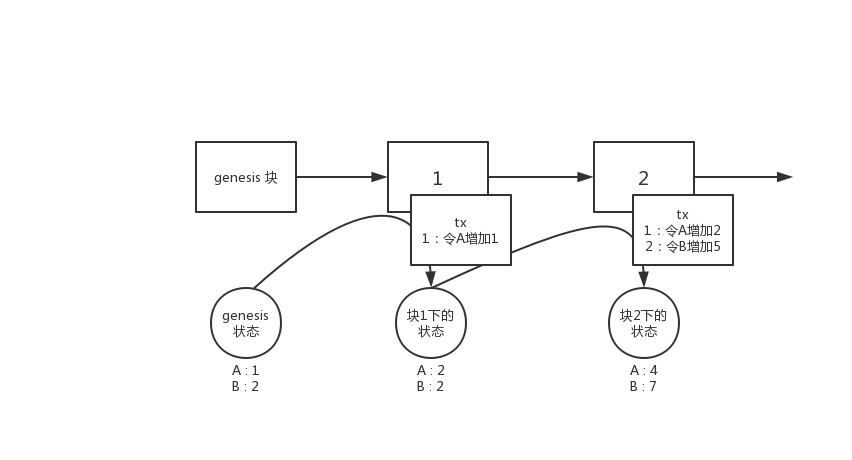
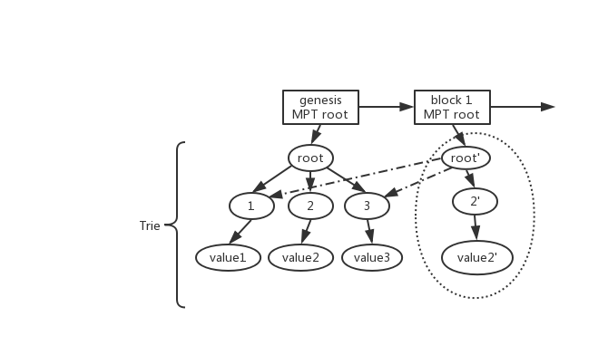

#  Substrate 入门 - 具备状态的链 -（三）

本文首先介绍substrate的模型基础。在能理解了“链的状态”和“交易”关系后，在此模型下才可深入Substrate的设计当中。

## 结论

首先先表述结论：Substrate的数据模型**与以太坊一致**，是**基于MPT**（Merkle Patricia Tree）的“全历史世界状态”模型。

这里展开讲一点：

当前区块链用于对业务进行建模的模型主要有两类：

1. UTXO 模型，即比特币及其分支的模型
2. 状态模型，即以以太坊为代表，包含eos及其他区块链等以记录状态为主的模型

因为当前主流描述业务的方式主要还是以**状态迁移**的模型去建模业务，因此状态模型的区块链能更容易支持更广泛的场景。

本系列只介绍状态模型，UTXO模型请参照笔者之前关于比特币的相关文章。

## 状态区块链

对于没有接触过状态区块链的开发者而言，首先请记住以下一些基础概念：

1. 当前状态是从genesis（即第0块，初始状态）开始，通过交易或其他方式产生了状态变更，不断累计出来的。
2. **状态并不是储存块中，而是节点自身独立维护的。**
3. 块中记录的是“状态迁移”的方式

如上图所示即是一个链的状态变化的过程。

比如在genesis的时候，状态为`A:1 B:2` 而经过块1的过程后，通过交易（tx）或其他因素，将A的状态修改成了2，因此在块1下的“世界状态”就变为了`A:2 B:2`。块2以此类推。

因此实际上块中并不是记录当前的状态，而是节点自己本地维护了一个“世界状态”。这个状态就是存在本地的数据库中。而块中保存的时“状态迁移”，“状态迁移”就是交易（或其他因素），节点同步/执行了一个区块后，通过区块中含有的迁移状态的方式（即是在执行这个区块），修改自己的本地状态，从而当一个块执行完毕后，本地当前的状态即为这个块下的状态。

而对于当前状态模型的链而言，一般情况下会具备如下的特性：

1. 最新块（最高块）下的状态即为当前的状态，在这个状态下可以**获取当前所有对象的状态**。
2. 块中含有对这个块下的状态的证明（即状态的统一性经过了节点间共识）
3. 可以通过任意一个历史的区块，取到在这个区块下的状态（如当前最高块已经是2，而通过1块中的相关信息可以取到`A:2`而不是最高块下的`A:4`）

这3个条件中只有1是必须满足的，往后越达成一个条件，需要付出的代价就要更多。若能满足这3个条件，即是“全历史世界状态”。

当然这里的词“全历史世界状态”是笔者自己造的，因为在以太坊的那个时代，还只有“世界状态”的概念。而实际上以太坊的“世界状态”是将每一个块的那个时刻的状态都做了“快照”，可以恢复到任意块的时候下的状态，也就是将全部的“状态变化历史”都保存下来的方式，因此笔者对这种模型命名为“全历史状态”。但是显然，这种方式将会将所有过去的历史都存下来，因此会造成数据量十分庞大。因此这种方式是状态区块链的一个极端。

而牺牲第3个条件，保留状态证明与只保留最新状态是一种权衡。而第3点就不再交由链来维护，而交给第三方的附属设施维护，如中心化数据库，区块链浏览器等等。

若连第2个条件也不用，则是状态模型的另一种极端，这种极端一定情况下牺牲了共识状态安全性。这种方式带来的好处是实现上比较简单。这即是eos的模型。

## MPT 实现的世界状态

由于Substrate采用了和以太坊一样的模型，因此满足上述的3个条件。在Substrate中MPT简称为`trie`。

对于MPT实现的原理这里不进行详细描述。简单来说MPT的实现和`git`，IPFS中的IPLD模型等原理上都是一致的，用一句话描述就是：

使用DAG的方式，只记录每次变更后的索引（hash）。

如下图所示：

例如在上文提到的状态`A:1 B:2`，将A，B分别看做两个key，在MPT中key就是树的路径，而`1,2`是key对应的值，在MPT中就是叶子节点。因此`A:1 B:2` 变更到`A:2 B:2`的这个过程中，对应到上图相当于：

* 从 root -> 2 -> value2 相当于记录了 `A:1`，从root->3->value3的过程相当于记录了`B:2`
* 从genesis到 block1 的过程中，A的状态发生了变化，从1变成了2
* 在MPT 中由于A的值发生了变化，因此MPT生成了一个新的叶子节点代表A的新状态，然后**从叶子节点重新生成一个新的索引路径**，即图中的 `value2' -> 2'-> root'`的过程
* 而在生成新路径的过程中，由于B的状态没有发生变化，因此在生成新的路径的过程中，直接索引了B的老路径（即图中的虚线）。
* 因此如上图所示，通过新的树根`root'` 索引到的A和B的值分别是`A：2`（即新的A的状态）与`B：2`（即老的B的状态）

如以上过程所示，每一个新的树跟记录的这个树根下状态的索引，因此每一个树跟即是每一个状态的DAG的起点，通过这个起点，可以获取到所有的状态。

每个区块都会含有状态变更，而每次变更即是通过以上类似过程生成一个新的树根，这个根root在以太坊及Substrate中被称为状态根 `state_root`，**放入每一个区块的区块头中**，作为当前这个区块进行共识的**状态证明**。而通过以上方式也可以看出，只要从任意区块中取出状态根，那么就可以获取到这个状态根下那个时刻的所有状态的值。（对于相当同的key A，通过 root 索引出 value2，通过 root' 索引出 value2'）

因此，MPT这种数据结构描述的世界状态，满足上述所说的3个条件。

## 另一个角度

抛开以上原理不谈，我们可以**将trie看成一个K-V数据库**，这个数据库通过给予的Key能够获取到对应的Value。只不过这个k-v数据库通过给予一个root可以索引出在这个root的那个时刻下的对应数据。

也就是说trie实现的链上状态就是一个带快照的k/v数据库。每一个块就是对当前数据库全部数据的快照，块的时间戳代表了那个时刻下的数据状态，通过块中的状态根可以获取那个时刻下的数据。

而在打包执行当前区块时使用的root即是上一个区块的root，也就是打包区块时取当前最新的状态。

在Substrate中对于Runtime层而言，提供的接口即是

* get(key) -> value
* set(key, value) / remove(key)

这样的接口对于Runtime而言，可以直接将trie树看做一个key/value数据库即可，屏蔽了所有的trie树细节。

因此对于初学者而言，若目前还不是很容易搞清楚trie树的实现细节，那么就不用关心，只需要记住Substrate的读写数据模型是**key/value数据库**即可。

## 总结

实际上状态模型区块链即使通过各种实现方式，能够在每个块下记录这个块当前的状态（key/value）。只不过使用mpt树实现的“全历史世界状态”是包含上文提到的3种性质的一种实现，这是一种极端，包含了证明与历史，但对应的也会带来数据的膨胀。

Substrate采用的是这种MPT树实现的状态区块链模型。

