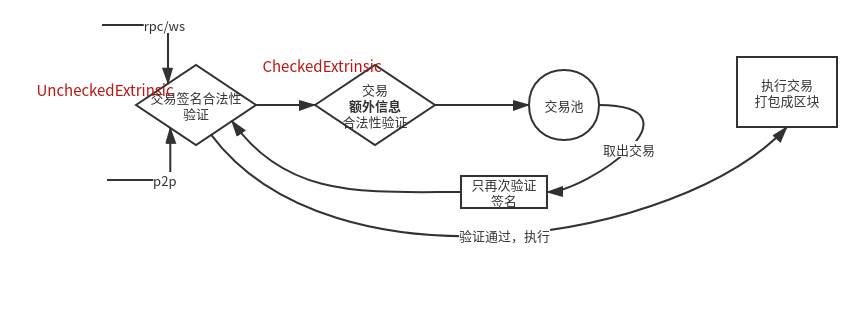

# Substrate 入门 - 交易体 -（六）

上一篇文章讲解了区块的构成之一--区块头，本章介绍Substrate中构成区块体的部分，交易。

在Substrate中的交易不再称为**Transaction**，而是称为了**Extrinsic**，中文翻译就是“**外部的；外表的；外源性**”，意味着被称为Extrinsic的概念，对于区块链而言是外部的**输入**（关于这种模型描述笔者在一些分享中讲过，但是没写成文章，之后有空贴一些ppt）。这种定义脱离了本身“交易”的范畴（更像是转账的概念），而是在链的状态的角度下，认为交易及类似概念是一种改变状态的外部输入（意味着不止转账，只要是外部的操作都是）。

不过为了兼容区块链原生的概念，本文及之后的文章还是把Extrinsic称为交易，或者“输入”。

## 定义

与Header不同，在Substrate中Extrinsic实际上具备极大的灵活性，能够允许开发者做出各种灵活的定制。

不过至少来说，一个“外部输入”至少会具备以下两个条件：

* 发送者的证明
* 外部输入的行为

其中第一点是显然的，只要基于公私钥体系，就一定需要发送者对这个发送的内容进行签名，在链上通过这个签名验证合法性，解析出发送者的公钥**识别身份**。等价于互联网中客户端持有的token这类的。而第二点就是这个“输入”是到链上干嘛的，其相当于是用户发送到链上的**指令行为**。

这两点对应到Substrate的交易模板上即为 `primitives/runtime/src/generic/unchecked_extrinsic.rs:L32`：

```rust
/// A extrinsic right from the external world. This is unchecked and so
/// can contain a signature.
#[derive(PartialEq, Eq, Clone)]
pub struct UncheckedExtrinsic<Address, Call, Signature, Extra>
where
	Extra: SignedExtension
{
	/// The signature, address, number of extrinsics have come before from
	/// the same signer and an era describing the longevity of this transaction,
	/// if this is a signed extrinsic.
	pub signature: Option<(Address, Signature, Extra)>,  // 对应第一点
	/// The function that should be called.
	pub function: Call,  // 对应第二点
}
```

其中显然：

* signature: 就是发送者的身份标示与验证的信息
* function: 就是发送者的意图指令，**类型为`Call`**，用于调用链上的相应功能，例如转账`transfer`。这块即是一条**链对外提供的功能**，也是一条链的Runtime的入口组成部分。一个区块打包了所有的交易，执行区块的过程即是在Runtime中执行每一条交易的`function`的指令。这部分在后续的文章中将会详细讲解。

这个交易模板实现了trait `primitives/runtime/src/traits.rs:L605`：

```rust
`primitives/runtime/src/traits.rs:L605`：/// Something that acts like an `Extrinsic`.
pub trait Extrinsic: Sized {
	type Call;
	type SignaturePayload;
	fn is_signed(&self) -> Option<bool> { None }
	fn new(_call: Self::Call, _signed_data: Option<Self::SignaturePayload>) -> Option<Self> { None }
}
/// A "checkable" piece of information, used by the standard Substrate Executive in order to
/// check the validity of a piece of extrinsic information, usually by verifying the signature.
/// Implement for pieces of information that require some additional context `Context` in order to be
/// checked.
pub trait Checkable<Context>: Sized {
	type Checked;
	fn check(self, c: &Context) -> Result<Self::Checked, TransactionValidityError>;
}
```

最终定义在Runtime中使用的交易的部分位于`bin/node/runtime/src/lib.rs:L566`

```rust
/// Unchecked extrinsic type as expected by this rundetime.
pub type UncheckedExtrinsic = generic::UncheckedExtrinsic<Address, Call, Signature, SignedExtra>;
// 其他用到 UncheckedExtrinsic 的就不写在这里了
```

## 分析

实际上由于最后定义交易的部分位于node的runtime中，根据之前文章，大家应该可以清楚的意识到这里的`UncheckedExtrinsic`实现是可以任意替换的。

实际上只要实现了`Extrinsic`与`Checkable`这两个trait，就可以成为Substrate的`Extrinsic`，其中：

* 前者提供了交易了功能性接口
* 后者提供了交易**进入交易池前的验证**接口

这里的结构体`UncheckedExtrinsic`只是Substrate默认提供的模板，开发者完全可以替换成自己的结构体。不过绝大多数情况下都不需要罢了。

这里笔者重点说一下`UncheckedExtrinsic`中的`signature`。

我们可以看到`signature`由3个部分组成：

* Address  发送者的地址
* Signature  发送者对交易体的签名
* Extra  **额外**的验证信息

这里很有意思的就是`Extra`这个东西。事实上这个部分可以允许开发者做很多事情，例如我们看以下在Substrate的node模板里面它做了`bin/node/runtime/src/lib.rs:L556`：

```rust
/// The SignedExtension to the basic transaction logic.
pub type SignedExtra = (
	frame_system::CheckVersion<Runtime>,
	frame_system::CheckGenesis<Runtime>,
	frame_system::CheckEra<Runtime>,
	frame_system::CheckNonce<Runtime>,
	frame_system::CheckWeight<Runtime>,
	pallet_transaction_payment::ChargeTransactionPayment<Runtime>,
	pallet_contracts::CheckBlockGasLimit<Runtime>,
);
```

在讲解这个之前，首先要介绍一下一个Extrinsic从外部到链内部的过程：



我们首先要看到，Substrate并非是在执行区块的时候才开始校验交易合法性的，而是在进入交易池之前就开始校验了。同时在最后执行交易前还会再校验一遍。其过程为：

首先验证交易的签名合法性，然后验证**额外信息（Extra）**的合法性验证，才进入交易池。

这块验证流程位于`frame/executive/src/lib.rs`   这里请**先记住`validate_transaction` 是进入交易池的验证过程**

```rust
	pub fn validate_transaction(uxt: Block::Extrinsic) -> TransactionValidity {
		let encoded_len = uxt.using_encoded(|d| d.len());
		let xt = uxt.check(&Default::default())?;   // 这里的check 来自 Checkable, 从 unchecked 变为 checked

		let dispatch_info = xt.get_dispatch_info();
		xt.validate::<UnsignedValidator>(dispatch_info, encoded_len)  // 这里对 checked 执行了 `validate` 进行额外信息的验证，请注意`validate`来自于 `SignedExtension` 这个trait
	}
```

而执行交易的流程为，这里请记住 `apply_extrinsic_with_len` 为真正执行交易的过程：

```rust
fn apply_extrinsic_with_len(
		uxt: Block::Extrinsic,
		encoded_len: usize,
		to_note: Option<Vec<u8>>,
	) -> ApplyExtrinsicResult {
		// Verify that the signature is good.
		let xt = uxt.check(&Default::default())?;  // 这里的check 来自于 Checkable，因此只执行了 check的过程（模板里即验签）
//...
}
```

**另一方面请注意**

由于刚才的`validate_transaction` 与`apply_extrinsic_with_len`都位于`frame/executive/`，因此实际上这个过程*根据前几篇文章*的介绍是**可以由开发者自己定义的！**因此开发者若觉得这个验证流程过于严格，或者不符合要求，完全可以修改这个验证过程。

还有需要注意的是，这里说的交易签名的验证是包括`Extra`提供的信息的。签名的校验指代的是对`function`和`extra`提供的附加验证条件进行校验。见`UncheckedExtrinsic`的实现（当然不使用模板自己实现的就可以更改这个过程），因此前端的交易组织签名的过程**应与这里所匹配**：

```rust
impl<Address, AccountId, Call, Signature, Extra, Lookup> Checkable<Lookup> {
	type Checked = CheckedExtrinsic<AccountId, Call, Extra>;
	fn check(self, lookup: &Lookup) -> Result<Self::Checked, TransactionValidityError> {
		Ok(match self.signature {
			Some((signed, signature, extra)) => {
				let signed = lookup.lookup(signed)?;
				let raw_payload = SignedPayload::new(self.function, extra)?;  //注意这里将会把其他附加信息添加到raw_payload 中
				if !raw_payload.using_encoded(|payload| {
					signature.verify(payload, &signed)  // 注意这里是对签名的 verify，对应的内容是`raw_payload`，因此前段的编码应和这里匹配
				}) {
					return Err(InvalidTransaction::BadProof.into())
				}
				// ...
			}
			// ...
		})
	}
}
```

## Extra

笔者这里通过介绍Extra的实现方式介绍Substrate常见的一种对多种相同行为的最佳实践方式：

首先我们看`SignedPayload::new(self.function, extra)?; `的实现内容

```rust
impl<Call, Extra> SignedPayload<Call, Extra> where
	Call: Encode,
	Extra: SignedExtension,
{	
	pub fn new(call: Call, extra: Extra) -> Result<Self, TransactionValidityError> {
		let additional_signed = extra.additional_signed()?;  // 这里我们要观察到  extra 是一个实现了 `SignedExtension` 的类型，并执行了 `additional_signed` 附加了一些其他校验的元素

	}
}
```

而另一方面请注意，在`bin/node/runtime/src/lib.rs:L556` 与 `L566` 中：

```rust
pub type UncheckedExtrinsic = generic::UncheckedExtrinsic<Address, Call, Signature, SignedExtra>;
// 填充到交易模板的 SignedExtra 部分来自于 
pub type SignedExtra = (
	frame_system::CheckVersion<Runtime>,
	frame_system::CheckGenesis<Runtime>,
//... 
);
```

这里请注意，`SignedExtra` 是一个**元组**，并非是一个`SignedExtension`的具体实现体。

而随便点入一个校验查看，如 CheckEra： `frame/system/src/lib.rs:L1048`

```rust
	fn additional_signed(&self) -> Result<Self::AdditionalSigned, TransactionValidityError> {
		let current_u64 = <Module<T>>::block_number().saturated_into::<u64>();
		let n = (self.0).0.birth(current_u64).saturated_into::<T::BlockNumber>();
		if !<BlockHash<T>>::exists(n) {
			Err(InvalidTransaction::AncientBirthBlock.into())
		} else {
			Ok(<Module<T>>::block_hash(n))
		}
	}
```

> 这里直接说明`Era`的作用实际上就是用于一个交易在交易池的存活条件。例如在比特币中，一个交易的手续费若太低，就会一直堆积在交易池中不被打包。而era就是在组件交易的时候附加一个条件，表面这个交易可以在交易池中存活多少个区块，若超出了这个区块范围还没被打包的话，就会从交易池中剔除。
>
> 因此比如若这里增加了这个判定条件，那么前端也要增加相应的参数，否则在刚才`validate_transaction`的过程中签名就会不匹配。

我们可以看到这里的`additional_signed`已经是一个具体的实现。

那么在Substrate中是怎么从“元组”的执行走到“具体实现”的执行过程呢？

那么显然，Substrate实际上应该对元组实现`SignedExtra` 这个trait，而且实现内容大概就是

```rust
impl SignedExtra for (A, B) {
    	fn additional_signed(&self) -> Result<Self::AdditionalSigned, TransactionValidityError> {
            let a = self.0.additional_signed()?;
            let b = self.1.additional_signed()?;
            Ok((a, b))  // 用某种方式把所有的 AdditionalSigned 拼起来
       }
}
```

会对元组中的每一个元组顺序执行，并把结果一并返回。因此在

```rust
pub type UncheckedExtrinsic = generic::UncheckedExtrinsic<Address, Call, Signature, SignedExtra>;
// SignedExtra 这里的位置可以直接接受一个元组，否则若元组没有实现这个trait，是无法编译通过的。
```

而这里的实现实际上就位于：`primitives/runtime/src/traits.rs:L787`：

```rust
#[impl_for_tuples(1, 12)]
impl<AccountId, Call, Info: Clone> SignedExtension for Tuple {
    //...
}
```

这里Substrate已经用了过程宏的形式了，不需要深究的开发者倒是没必要搞的特别清楚。总之简单来说，通过这种形式，Substrate实现了类似：

```rust
impl SignedExtra for (A, ) {}
impl SignedExtra for (A, B) {}
impl SignedExtra for (A, B, C) {}  // 支持3元组
// .....
impl SignedExtra for (A,  B, C ....K , L) {} // 支持12元组
```

的这样一个过程。因此实际上能够传入`generic::UncheckedExtrinsic<Address, Call, Signature, SignedExtra>;`的SignedExtra的元组最大应该不能超过12个。

**Substrate在Runtime的很多基础库的实现都采用了类似的方式**，因此在定义runtime的地方`bin/node/runtime/src/lib.rs`经常可以看到这种元组传入定义的形式。

另一方面由于`additional_signed`的返回值是影响交易签名的验证的，因此前端应注意，附加这些额外验证信息的时候，其顺序应该与在`bin/node/runtime/src/lib.rs`**中`SignedExtra`元组的顺序相同**

## 总结

本文介绍了Substrate中交易的设计方式。通过分析可以看出，Substrate的交易实际上设计的具备极强的扩展性，开发者完全可以根据自己的功能需求。

文中只讲解了其原理，没讲其是怎么使用的。这里简单说一下，Substrate可以用这种模型实现。

* 手续费检查
* 手续费检查
* 交易版本与链上版本检查
* 交易存活性检查
* 特殊交易的额外信息检查
  * 例如如果一个交易是转账transfer，可以直接检查发送者的余额是否足够，不用到区块执行阶段才判定。

因此在明白了substrate的交易设计后，可以灵活的根据需求对其进行改动。