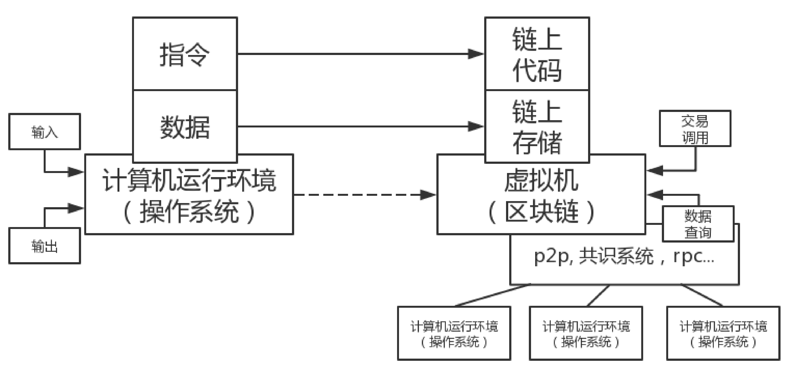
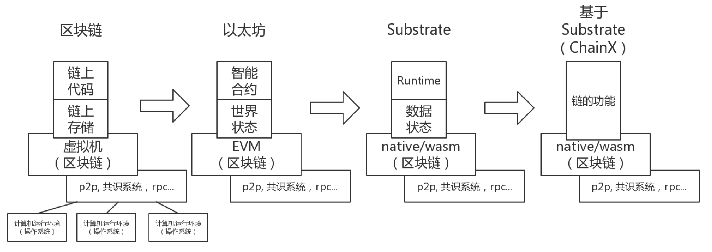

# Substrate 入门 - Substrate的模型设计 -（七）

上两篇已经描述了Substrate对与“区块链”的基本元素 -- 区块头 与 交易 的设计，后续的文章将会着重开始介绍Substrate对于开发者开放的核心设施-- Runtime。因此本文首先需要重新更加具体的介绍Substrate的设计模型，在有这个概念的基础上后续才能方便讲解。

## 程序与具备逻辑功能区块链



如图所示，我们将现代计算机的程序模型与当前的区块链模型比较，可以得到如下的抽象：

1. 程序由指令与数据构成，对应到链上即为链上代码（例如以太坊的合约，fabric的chaincode，substrate的Runtime）和链上存储（以太坊和fabric都叫做世界状态world state，Substrate中叫Runtime Storage，也是世界状态）
2. 程序接受用户的输入，经过处理后得到输出，对应到链即为接受区块中的交易，执行后修改状态。用户可以以**异步**的方式去查询执行后的结果以代表执行后的输出。请注意区块由于需要经过共识的过程，因此对于结果的判定一定得等到区块的共识达成（又称为区块finality后），才能进行查询。因此区块链是一个异步的系统。这里接受交易的调用即是接受一个Extrinsic，外部的的输入。
3. 程序需要运行在计算机的操作系统环境里（非指代无需操作系统的程序），对应到链而言是运行链上代码所需要的一个**沙盒**环境，这个沙盒环境是要去除io，网络访问等会产生“副作用”的沙盒。在以太坊中这个环境是EVM，fabric是docker，substrate中即是Runtime的运行环境。

因此我们可以看出，在这种角度的抽象上，区块链的系统与正常的程序的模型实际上是非常相似的。

## 区块链与模型的对应关系

那么对应于上图右边部分区块链模型的描述，一些具体的链即对应如下的情况：



以太坊这里就不再赘述了，从Substrate开始。在Substrate中，**广义上**我们一般把整个链上运行环境，包含链上代码与链上存储，整体称为Runtime。

不过一般**狭义上**我们只把链上代码称为Runtime，也就是使用Substrate的链开发者需要主要进行开发的部分，而链上的数据我们称为Runtime Storage。执行链上代码的执行器及环境我们称为Runtime执行环境。

Substrate的Runtime执行环境的特别之处在于，其设计为了“同一套代码编译出2种执行文件”。其设计原理与优势请参考《[Substrate 设计总览](https://zhuanlan.zhihu.com/p/56383616)》这篇文章。

Substrate对于Runtime(狭义)编译出的WASM版本，需要存在于“链上存储”才可生效，又由于“链上存储”是所有节点都共享的数据，因此对于所有节点而言，若执行的是WASM版本的，则一定是同一份代码。

Substrate的Runtime是携带Runtime的版本信息的`bin/node/runtime/src/lib.rs:L73`：

```rust
/// Runtime version.
pub const VERSION: RuntimeVersion = RuntimeVersion {
	spec_name: create_runtime_str!("node"),
	impl_name: create_runtime_str!("substrate-node"),
	authoring_version: 10,
	// Per convention: if the runtime behavior changes, increment spec_version
	// and set impl_version to equal spec_version. If only runtime
	// implementation changes and behavior does not, then leave spec_version as
	// is and increment impl_version.
	spec_version: 198,
	impl_version: 198,
	apis: RUNTIME_API_VERSIONS,
};
```

注意`spec_version`上方的注释，这里说明了对于Substrate的Runtime的执行器而言，认准的是`spec_version`的值。（`spec_version`是代码里面的一个**常量**）请注意由于Runtime是一份代码编译出2份执行文件，因此例如改动了`spec_version`的值，编译节点称为了新的节点，但是没有编译wasm，则从wasm代码里面取出的`spec_version`一定与新编译出的节点二进制中保留的`spec_version`的值不同。参见《[Substrate 设计总览](https://zhuanlan.zhihu.com/p/56383616)》中的介绍，对于Substrate的Runtime执行器而言，当版本信息不同时，会采用WASM版本的为准。（当然若是一个恶意节点自己改动了Runtime执行器的代码，例如就是只认本地native的版本信息，那么当然也是可以的。只是只要不是绝大多数人都是恶意节点，那么链就只会遵循绝大多数人的共识进行。因此只要非恶意节点都是遵循了这个规则，那么它就是有效的。）

在《[Substrate 入门 - 运行与调试 -（二）](https://zhuanlan.zhihu.com/p/94879423)》中介绍了若希望以debug的形式调试，一定要运行native，其指代的就是和这部分有关。在现在这个版本的Substrate里，我们对node执行`--help | grep exec`可以看到和执行相关的命令：

* `--execution`  : 对于所有的执行采用的方式
* `--execution-block-construction` ： 对于打包区块执行的时候采用的方式
* `--execution-import-block`：从文件导入区块执行的时候采用的方式
* `--execution-offchain-worker`：offchain 执行的时候采用的方式
* `--execution-other` ：在他调用api的时候采用的方式，如设置内部交易，rpc调用等其他环节
* `--execution-syncing`：从p2p同步区块的时候采用的方式

以上的指令能接受的参数都有：`Native, Wasm, Both, NativeElseWasm`，从命名方式上应该就可以看出其特点。但总体来说，这些命令从本质上来说，就是指代在执行不同情况下的时候，**应该采用哪一份（native/wasm）代码**。

由于在之前的模型抽象部分已经介绍了，对于“执行环境”而言，其本质是一个沙盒，且需要避免一些会带来副作用（相同的执行可能会产生不同的结果）的情况，因此虽然在Substrate中的Runtime是由Rust编写，可以编译成为Rust的native代码及wasm代码，但**其本质上并非能调用到Rust的所有std库提供的接口，同时若引入新的库，若只支持std，不支持no_std的库也是无法通过编译的。**

若对这套体系不清楚的话，简单的来说请注意，所有需要出现在Runtime编译依赖的库中，其`Cargo.toml`的最后几行都会出现：

```toml
[dependencies]
# 在 dependencies 中，一定要有 default-features = false
frame-system = { version = "2.0.0", default-features = false, path = "../system" } 
# ... 
[features]
default = ["std"]
std = [
	"serde",
	"codec/std",
	"sp-std/std",
	"sp-io/std",
    # ...
]
```

这样的字样。这里表示`default`的feature是“std”，且对于`dependencies` 中的依赖，一定是不启用默认features的（`default-features`）

且在该crate的根目录下的`lib.rs`的前几行，一定会出现

```rust
#![cfg_attr(not(feature = "std"), no_std)]
```

这样的条件编译的字样。这里表示“若没有在std的条件编译下，则对于该crate采用`no_std`”。

**另一方面，广义的Runtime即是这条链的“业务逻辑”，也就是“链的功能”。**

## 总结

本文从一个角度描述了当前区块链的设计模型框架，并介绍了在这个框架下，Substrate是如何的一种对应关系。并且强调了在Substrate中，其执行器是以“同一份代码，两种可执行文件”的形式存在，且联系了之前对于Substrate概要设计的介绍，关联起来了区块链设计模型与Substrate的概要设计之间的关系。