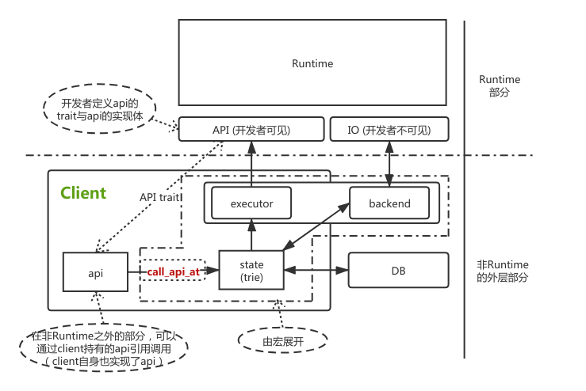

# Substrate 入门 - Runtime概要 -（八）

承接上一篇文章，在介绍了Substrate的模型设计后，终于可以开始进行Substrate的Runtime部分的介绍。本篇首先介绍Runtime的概要模型，为后续文章打下基础。

上一篇文章已经介绍了对于运行“链上代码”的部分是一个沙盒，因此Runtime的模型从本质上而言就是一个与其他环境隔绝的沙盒。那么对于一个沙盒而言，由于其与外界隔绝，因此必定有相应的口子让Runtime与外界进行交互。因此Runtime对外开的口子主要分为2类：

* IO：负责Runtime Storage 的Read/Write.
* API：Runtime与一切外界元素交互的入口，例如：
  * **创建区块**
  * **执行交易**
  * **验证交易合法性**
  * Runtime的metadata （关于metadata今后专门撰写文章介绍）
  * 结构化读取Runtime存储
  * 执行合约
  * 等等...

## Runtime的模型概要

Runtime的模型本质上如下所示：



实际上图中所示的已经是最简化版本，这里只是表明这个意思，实际的实现还要更复杂一下。在图中需要留意的关键有以下几点：

### 1. Runtime 对外层的接口

在图中明显的表明，Runtime对外层的接口实际上只有两种：

* IO
* API

其中IO是对于开发者不可见的，对于Runtime的IO接口后续会专门撰写进行介绍。本文重点介绍API接口。

这里的API我们命名为Runtime API，其在Runtime的运转中具有极其重要的意义。不过由于最关键的区块构建，交易执行的api由Substrate Core 负责了，因此对于普通开发者而言，懂个大概就足够了。

这里要专门介绍Runtime的意义在于，与区块链的模型相比，**可以看出Substrate的Runtime抽象力争于将“Runtime的概念”与“链”的概念进行解耦，让Runtime脱离链的执行环境（打包区块，执行交易），转而成为是Runtime向外界提供构建区块，执行交易的接口**。

因此在其他区块链模型中，一般遵循：

> 出块打包/同步区块 -> 执行 -> 创建环境 -> 调用交易中对应的某个函数接口

而在Substrate的Runtime模型中，遵循

> 出块打包/同步区块 -> 执行 -> 创建环境 -> **调用Runtime的执行区块api** -> 进入Runtime层（在执行区块的过程中，才会调用交易中对应的函数接口）

因此在这种模型下，一个完整的Runtime**可以承载在不同的外界环境中运行**：

1. 例如使用c++重新实现Runtime的执行环境体
2. 在浏览器中运行WASM
3. 波卡的**分片跨链的平行链**
4. 等等...

因此我们在Substrate的runtime构建的过程中，可以看到其为Runtime定义了一些`Core`的api，用于执行区块链的核心逻辑：

定义api代码：`primitives/api/src/lib.rs:L464`

```rust
decl_runtime_apis! {
   /// The `Core` runtime api that every Substrate runtime needs to implement.
   #[core_trait]
   #[api_version(2)]
   pub trait Core {
      /// Returns the version of the runtime.
      fn version() -> RuntimeVersion;
      /// Execute the given block.
      #[skip_initialize_block]
      fn execute_block(block: Block);
      /// Initialize a block with the given header.
      #[renamed("initialise_block", 2)]
      #[skip_initialize_block]
      #[initialize_block]
      fn initialize_block(header: &<Block as BlockT>::Header);
   }

   /// The `Metadata` api trait that returns metadata for the runtime.
   pub trait Metadata {
      /// Returns the metadata of a runtime.
      fn metadata() -> OpaqueMetadata;
   }
}
```

实现代码：`bin/node/runtime/src/lib.rs:L609`

```rust
impl_runtime_apis! {
   impl sp_api::Core<Block> for Runtime {
      fn version() -> RuntimeVersion {
         VERSION
      }

      fn execute_block(block: Block) {
         Executive::execute_block(block)
      }

      fn initialize_block(header: &<Block as BlockT>::Header) {
         Executive::initialize_block(header)
      }
   }
    // metadata...

   impl sp_block_builder::BlockBuilder<Block> for Runtime {
      fn apply_extrinsic(extrinsic: <Block as BlockT>::Extrinsic) -> ApplyExtrinsicResult {
         Executive::apply_extrinsic(extrinsic)
      }
		// ...
   }
	//...
}
```

在Substrate中，对于API的实现极其复杂，采用了很多宏的实现。由于本系列只是入门，所以这里我们不探究宏背后的实现，直接给出案例说明结论：

对于一个API，首先需要对其进行声明，通过宏`decl_runtime_apis!`，然后对应于声明过的宏，需要在Runtime内部（例如在`node/runtime/src`下）对其进行实现，而实现的方式也只能通过宏`impl_runtime_apis!`

毕竟Substrate是以“区块链”的模型存在的，因此我们可以看到在`primitives/api/src/lib.rs`中声明了`Core`的api（注意这里位于的包是在primitives下，参见前几文章对模块分类的介绍）。在这个api的声明中，拥有3个关键的接口：

* `version`  Runtime的版本，参见之前文章对Runtime版本的介绍
* `execute_block` 执行一个区块，接受的参数是`Block`
* `initialize_block` 初始化一个区块，注意这个函数接受的参数是`Header`

可以看到这个接口覆盖了一个链的基本核心，因此每一条链至少都必须实现这里定义的`Core`API接口。

另一方面我们观察他的实现，例如：

```rust
fn execute_block(block: Block) {
	Executive::execute_block(block)
}
```

其中调用了`Executive`的函数。请注意这里的Executive已经是Runtime的内部模块了，其对应的`frame`中的`executive`包`frame/executive/`，参见之前的对于模块分类的文章，我们可知实际上这里的`Executive::execute_block(block)`是可以被任意替换的，这意味着开发者完全可以实现自己的区块执行逻辑，且若更改了这个执行逻辑，在任意能承载Runtime运行的平台上**都可以统一运行**，而**不需要把不同平台的区块执行逻辑都做相同更改**（结合上文描述Runtime运载不同平台的介绍）。

另一方面我们来看看另一个api接口`BlockBuilder`

该接口专门负责的一个区块的构建过程，（与刚才`Core`中的执行区块分开，这里的区块的提议过程proposal）。

这里我们只看`apply_extrinsic`这个接口，这个接口即是打包区块过程中的执行交易接口。显然要执行交易，其交易一定是从外部传入进来的，那么我们可以跟随这个接口，介绍一下Runtime是如何与外部通过api进行交互的。

### 2. 外部与Runtime交互的方式

在一开始的图里，笔者显然支出一个api的调用，必定需要包裹在`Client`里。在后文介绍API和client的关系。这里我们跳过这层关系，直接找一个区块的打包过程。

显然一个区块能被创建出来，其**必定是在共识流程**中，在Pos中，一般都会退选出一个proposer来构建出这个区块，这里直接指出代码位于`/client/basic-authorship/src/lib.rs:L169`（注意这里位于client目录下）：

```rust
let mut block_builder = self.client.new_block_at(
			&self.parent_id,
			inherent_digests,
			record_proof,
		)?;

		// We don't check the API versions any further here since the dispatch compatibility
		// check should be enough.
		for extrinsic in self.client.runtime_api()
			.inherent_extrinsics_with_context(
				&self.parent_id,
				ExecutionContext::BlockConstruction,
				inherent_data
			)?
		{
			block_builder.push(extrinsic)?;  // 这里出现了 builder.push()
		}
		//...
		debug!("Attempting to push transactions from the pool.");
		for pending_tx in pending_iterator {
		//...
			let pending_tx_data = pending_tx.data().clone();
			let pending_tx_hash = pending_tx.hash().clone();
			trace!("[{:?}] Pushing to the block.", pending_tx_hash);
            // 这里即是打包区块的过程，将交易push进入 builder 过程中，这里的Push和刚才的Push一致
			match sc_block_builder::BlockBuilder::push(&mut block_builder, pending_tx_data) {
				Ok(()) => {
					debug!("[{:?}] Pushed to the block.", pending_tx_hash);
				}
                // ...
            }
         // ...
}
```

而我们来看一下`push`的实现`client/block-builder/src/lib.rs:L128`:

```rust
pub fn push(&mut self, xt: <Block as BlockT>::Extrinsic) -> Result<(), ApiErrorFor<A, Block>> {
		let block_id = &self.block_id;
		let extrinsics = &mut self.extrinsics;

		if  // ...
		{
			// ...
		} else {
            // 请注意这里的 api.map_api_result
			self.api.map_api_result(|api| {
                // 请注意这里的 api.apply_extrinsic_with_context
				match api.apply_extrinsic_with_context(
					block_id,
					ExecutionContext::BlockConstruction,
					xt.clone(),
				)? {
					// ...
				}
			})
		}
	}
```

由于宏展开的过程十分复杂，这里直接告诉读者，这里的`apply_extrinsic_with_context` 实际上最后即调用到了runtime中对于api的实现体：

```rust
	impl sp_block_builder::BlockBuilder<Block> for Runtime {
		fn apply_extrinsic(extrinsic: <Block as BlockT>::Extrinsic) -> ApplyExtrinsicResult {
			Executive::apply_extrinsic(extrinsic)
		}
}
```

中，也就是说`apply_extrinsic_with_context`在一系列的宏张开的调用过程中，最后调用到了runtime层，调用了`apply_extrinsic`，并进而调用了真正的实现体`Executive::apply_extrinsic(extrinsic)`

读者只需要记住，定义的Runtime的api，通过宏展开后，会在生成：

* 原名函数
* 原名函数\_with\_context  (这里的context主要是为区分不同的执行上下文，需要提供一个不同的context环境，否则在原函数名称的实现中，默认会传入`Context::OffchainCall(None)`)

这个生成的函数实际上是赋予的Runtime的Api对象`RuntimeApiImpl`，这里不展开这个是怎么来的，只需要明白在`impl_runtime_apis`展开后，对于原函数的实现会**包装**一些如一开始的图中的调用实现，然后会生成一个api对象，这个对象最后会**赋给client的api属性**

```rust
impl<B, E, Block, RA> Client<B, E, Block, RA> {	
	pub fn new_block(
		&self,
		inherent_digests: DigestFor<Block>,
	) -> sp_blockchain::Result<sc_block_builder::BlockBuilder<Block, Self, B>> where	
///
	{
		let info = self.chain_info();
		sc_block_builder::BlockBuilder::new(
			self,  // 注意这里的 BlockBuilder 的 api_ref 参数传入的是 self，也就是说是client自身
            //..
        )
    }
}
impl<'a, Block, A, B> BlockBuilder<'a, Block, A, B> {
    pub fn new(
		api: &'a A,
		parent_hash: Block::Hash,
		parent_number: NumberFor<Block>,
		record_proof: RecordProof,
		inherent_digests: DigestFor<Block>,
		backend: &'a B,
	) -> Result<Self, ApiErrorFor<A, Block>> {
        // 留意这里的header
		let header = <<Block as BlockT>::Header as HeaderT>::new(
			parent_number + One::one(),  // 请留意这里的header是在parent 上+1，即意味着下一个区块！
			//...
		);
		let mut api = api.runtime_api();
		//...
        let block_id = BlockId::Hash(parent_hash); // 注意这里的 block_id 来自的是 parent!!!
        // 这里的 initialize_block_with_context 即是调用了runtime 的api实现里`Core`下的initialize_block函数
		api.initialize_block_with_context(
			&block_id, ExecutionContext::BlockConstruction, &header,
		)?;

		Ok(Self {
			parent_hash,
			extrinsics: Vec::new(),
			api,  // 这里的api即是来自client
			block_id, // 这里传入的是 parent （也就是当前最新区块）的blockid
			backend,
		})
    }
}
```

由以上这段代码可以看出，client自身可以通过`runtime_api`获取到api实例（这里就不介绍怎么来的了），通过api可以调用`initialize_block_with_context`，然后block_builder会持有这个api引用，因而在`push`里面可以通过api调用`apply_extrinsic_with_context`。

因此整个过程就梳理清楚了，Substrate抽象了Runtime，并且对于Runtime对外界的接口采用了定义api，实现api的方式。这种api的形式会**通过宏展开的形式**，将定义的api的调用方式赋予给Runtime外层的client对象。而在笔者比较早期的文章介绍过，substrate的架构实现实际上和`c++`版本的Ethereum近似，所以这里的client和c++的Ethereum一样，**实际上是一个节点运行中的单例，持有了所有的运行时对象并具备访问数据库能力的一个集合对象。**通过client可以调用到Runtime的api，进而实例化Runtime并进行相应函数的调用。

那么这里的问题就随之就来了，通过外部调用runtime的api，需要通过如此复杂的宏展开的方式么？答案是：其实不一定，但是目前似乎是这么做最好。

理由就是我们首先需要观察到，在runtime内的api定义的函数，与api调用的函数有什么区别？

### 3. 外部加载状态调用的Runtime

那么在外界api可以调用的`apply_extrinsic`并附带函数签名是：

* `apply_extrinsic_with_context(block_id: BlockId, context: sp_api::ExecutionContext, e: xt: <Block as BlockT>::Extrinsic)`
* `apply_extrinsic(block_id: BlockId, context: sp_api::ExecutionContext, e: xt: <Block as BlockT>::Extrinsic)`

这里直接告诉读者带`_with_context`的版本与不带的其他部分实现是一样的，区别只是在于提供的context，而不带的版本默认为`Context::OffchainCall(None)`

而在Runtime内定义的函数签名为

```rust
fn apply_extrinsic(extrinsic: <Block as BlockT>::Extrinsic);
```

如果比较不带`_with_context`的版本，我们可以显然的注意到在外部调用的api的版本中，与在Runtime中定义的相比，多了一个`blockid`。

实际上这里的blockid即是一个状态区块链运行的核心 -- 基于某个状态去执行Runtime。

在2的部分中，代码的注释里，笔者强调了注意blockid传入的值是什么。由于构建区块显然是要基于最新（或该节点认为应该基于的区块）状态进行构建，因此传入了`parent`。

在本文开头的图里，有一个虚线框框住了`state`,`executor`,`backend`等，并表明这个框的内部都是由宏展开实现的。api通过`call_api_at`(其也是宏展开内的东西)，基于一个给予的state（即通过调用api时传入的blockid），创建环境并调用执行器去执行。在这个执行环境下，Runtime的IO读取，即Runtime Storage也是在该环境下基于该State进行读写。

**显然若指定了不同的State，那么执行api时基于的环境就将会不同，因此例如想要实现读取过去的状态等功能时，即是通过状态不同的状态实现**

而关于不同的State的细节，请参考笔者之前关于[《基于状态的链》](https://zhuanlan.zhihu.com/p/96866051)的相关文章

因此若不管所有细节，读者需要明白的就是：

**对于Runtime对外通过api定义并暴露的接口，在Runtime外通过api调用时，需要指定执行该api需要基础的状态，即表明“基于某个状态去执行Runtime的api调用”**

而这个状态即是通过宏展开的api的第一个参数blockid去指定。

## 总结

Substrate的Runtime抽象在笔者看来是一个比较出色的抽象，其将Runtime的概念与区块链本身进行的剥离，虽然通过比较奇怪且难以理解的宏的实现方式，**但是将Runtime的api与外界调用api的过程进行的挂接，使得加载一个Runtime需要通过一个状态去执行。**在这里调用过程中封装了许多复杂的过程，本文不展开讲解，因此读者只需要记住2点：

1. 外界沟通Runtime的方式的唯一入口是通过Runtime的api，api可以由开发者自由定制
2. 调用api的时候需要装载执行这个api时基于的环境，加载了不同的状态，那么意味着在这个状态下去执行api